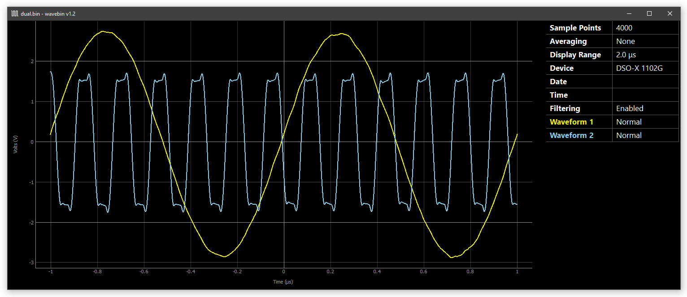

# wavebin
**wavebin** is a tool for viewing waveform files (``.bin``) generated by Keysight oscilloscopes.



Currently **wavebin** has been tested with files from a [**DSO-X 1102G**](https://www.keysight.com/en/pdx-2766207-pn-DSOX1102G/oscilloscope-70-100-mhz-2-analog-channels). If you have access to waveform files from other Keysight oscilloscopes, please submit them for testing through the [Sample Waveforms issue](https://github.com/sam210723/wavebin/issues/1).

## Getting Started
**wavebin** is available through the [Python Package Index](https://pypi.org/project/wavebin/). To install **wavebin** and its dependencies ([magnitude](https://pypi.org/project/magnitude/), [numpy](https://numpy.org/), [pyqt5](https://pypi.org/project/PyQt5/), [pyqtgraph](http://www.pyqtgraph.org/)), run the following command:

```
pip install wavebin
```

To view a waveform with **wavebin**, run the following command:

```
python -m wavebin [PATH TO BIN FILE]
```

Use the``-v`` option to see detailed information about the waveform file:

```
wavebin v1.0

Loading "samples\sample.bin"...
File Size:              7.79 KB
Waveforms:              1

Waveform 1:
  - Wave Type:          NORMAL
  - Wave Buffers:       1
  - Sample Points:      1953
  - Average Count:      1
  - X Display Range:    2000.0001 us
  - X Display Origin:   -1000.0000 us
  - X Increment:        1024.0000 ns
  - X Origin:           -1000.0000 us
  - X Units:            SECONDS
  - Y Units:            VOLTS
  - Date:
  - Time:
  - Frame Type:         DSO-X 1102G
  - Frame Serial:       CN12345678
  - Waveform Label:     1
  - Time Tags:          0.0
  - Segment Number:     0

[DATA] Type: FLOAT32    Depth: 32 bits    Length: 7812 bytes
Rendering 1 waveform...
```

## Resources
  - [FaustinCarter/agilent_read_binary](https://github.com/FaustinCarter/agilent_read_binary)
  - [yodalee/keysightBin](https://github.com/yodalee/keysightBin/)
