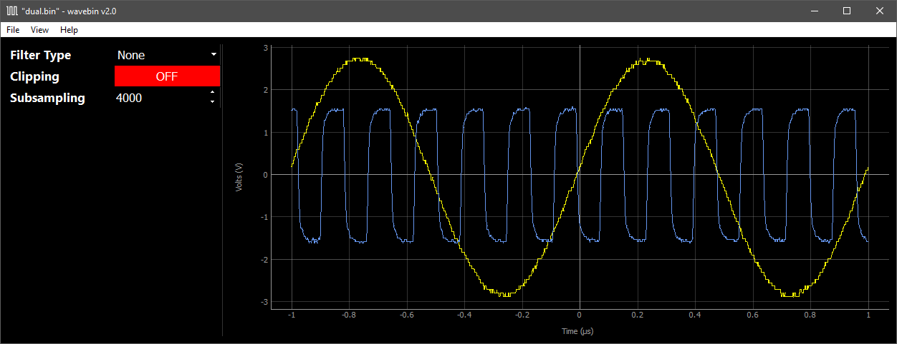

# wavebin - Waveform Capture Viewer

[](https://pypi.org/project/wavebin/)
[](https://pypi.org/project/wavebin/)
[](https://pypi.org/project/wavebin/)
[](https://libraries.io/pypi/wavebin)
[](https://github.com/sam210723/wavebin/master/LICENSE)

**wavebin** is a waveform capture viewer for Keysight oscilloscopes. These capture files are generated on the oscilloscope as ``.bin`` files, which can be saved to a USB Mass Storage device for transfer to a PC.



Currently **wavebin** has been tested with files from a [**DSO-X 1102G**](https://www.keysight.com/en/pdx-2766207-pn-DSOX1102G/oscilloscope-70-100-mhz-2-analog-channels). If you have access to waveform files from other Keysight oscilloscopes, please submit them for testing through the [Sample Waveforms issue](https://github.com/sam210723/wavebin/issues/1).

## Getting Started

**wavebin** is available through the [Python Package Index](https://pypi.org/project/wavebin/). To install **wavebin** and its dependencies ([numpy](https://numpy.org/), [pyqt5](https://pypi.org/project/PyQt5/), [pyqtgraph](http://www.pyqtgraph.org/)), run the following command:

```
pip install wavebin
```

To view a waveform with **wavebin**, run the following command:

```
python -m wavebin [PATH TO BIN FILE]
```

The ``-f`` option enables a [Savitzky-Golay](https://web.archive.org/web/20150710002613/http://wiki.scipy.org:80/Cookbook/SavitzkyGolay) low-pass filter which smooths out waveforms. This option is not useful for all waveforms (e.g. high-frequency square waves) as it will create distortion.


Use the ``-v`` option to see detailed information about the waveform file:

```
wavebin v1.2

Loading "single.bin"...
File Size:              7.79 KB
Waveforms:              1

Waveform 1:
  - Wave Type:          Normal
  - Wave Buffers:       1
  - Sample Points:      1953
  - Average Count:      1
  - X Display Range:    2000.0 μs
  - X Display Origin:   -1000.0 μs
  - X Increment:        1024.0 ns
  - X Origin:           -1000.0 μs
  - X Units:            Seconds
  - Y Units:            Volts
  - Date:
  - Time:
  - Frame Type:         DSO-X 1102G
  - Frame Serial:       CN00000000
  - Waveform Label:     1
  - Time Tags:          0.0
  - Segment Number:     0

[DATA] Type: float32    Depth: 32 bits    Length: 7812 bytes


Rendering 1 waveform...
```

## Resources

- [FaustinCarter/agilent_read_binary](https://github.com/FaustinCarter/agilent_read_binary)
- [yodalee/keysightBin](https://github.com/yodalee/keysightBin/)
